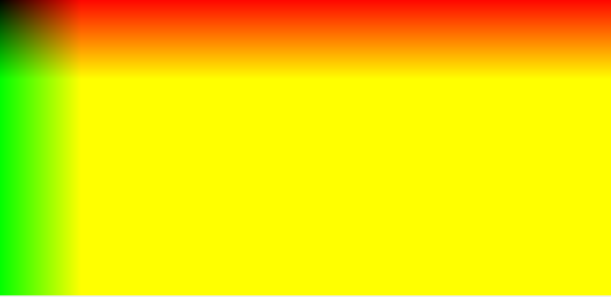
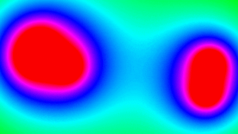

# metabolas

Supongamos que tenemos un plano de coordenadas.
La idea es dar un color a cada punto (x,y) en funcion del mismo par (x,y).
Osea, hay una funcion f tal que f(x,y) es un color.

Si definimos $f(x,y) = (x,y,0)$, donde la terna que devuelve la funcion es un color en RGB, y corremos para cada punto del plano la funcion, obtenemos lo siguiente:

La esquina de arriba a la izquierda es el origen (0,0), entonces a medida que nos movemos para la derecha desde el origen irá aumentando x, osea el color rojo se hace mas fuerte.
Lo mismo si desde el origen solamente bajamos, aumenta la coordenada y, y tambien el color verde.
A medida que nos acercamos a la esquina de abajo a la derecha se juntan el rojo y el verde, formando el amarillo.

Veamos algo un poquito mas complicado;

Sea (a,b) el punto en el centro del plano.

Definamos:

$$
f(x,y) = \sqrt{(x - a)^2 + (y - b)^2} = \mathrm{dist}((x,y),(a,b)) = \text{distancia entre el punto } (x,y) \text{ y el centro del plano.}
$$

Si ahora en lugar de usar RGB usamos escala de grises, a medida que nos alejamos del centro se hace todo mas claro:

Podemos explayarnos, y en lugar de tener un punto fijo en el centro tener un circulo de radio r que se mueve; Podemos hacer $f(x,y) = r/dist((x,y),(a,b))$ a medida que se mueve y invertir los colores con respecto a como lo haciamos antes; Ahora el centro es blanco y a medida que nos alejamos es mas oscuro. (En js la division por 0 dá infinito y no error).

Pero y si hubiesen varios circulos? Como deberia colorearse cada punto (x,y) del plano?

De acá viene la idea de "meta-balls"; Colorear cada punto (x,y) del plano con respecto a la distancia entre dicho punto y cada circulo.

Imaginemos entonces que tenemos varios circulos centrados en (a1,b1), (a2,b2),...,(an,bn) de radios r1,r2,...,rn respectivamente. La formula magica que buscamos es: $f(x,y) = \sum(ri/dist_i)$. Mientras mas cerca esten 2 circulos de un punto, menor la distancia a ese punto y mayor el valor de la funcion.

En escala de grises queda así:

Incluso podriamos volver a RGB y definir $f(x,y) = (sum, 255, 255)$, con $sum=\sum(ri/dist_i)$

Me encanta como genera ese efecto de sustancia aceitosa/pegajosa; La formula que usamos es una de muchas. A futuro voy a actualizar este repo probando otras. 

---
Basado en este [video de Daniel Shiffman]([https://link-url-here.org](https://www.youtube.com/watch?v=ccYLb7cLB1I))

